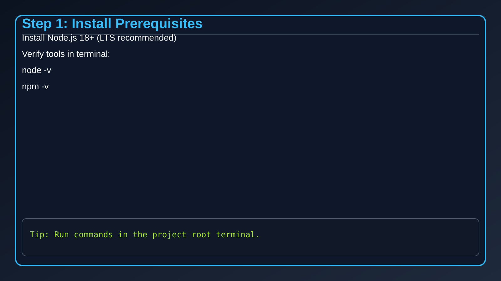
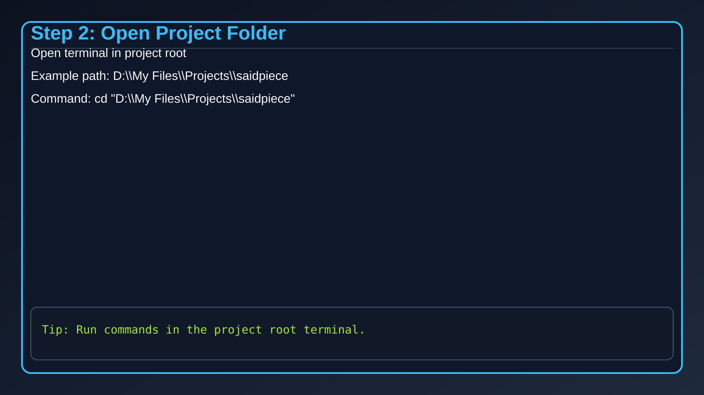
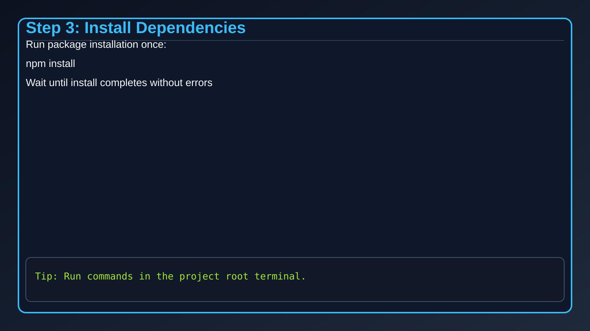
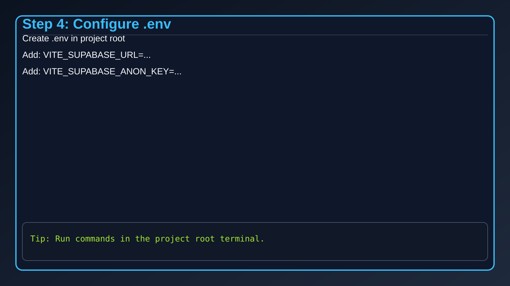
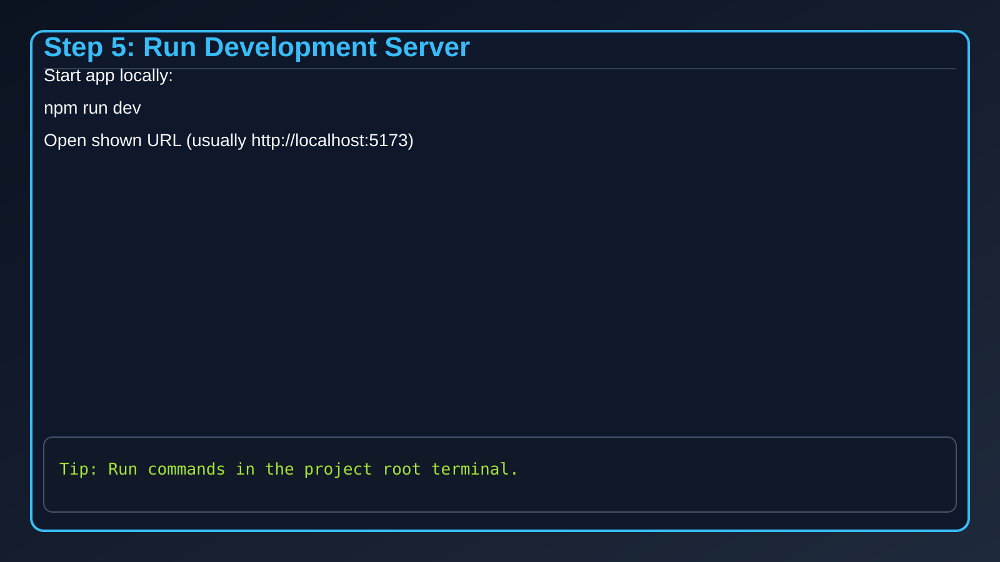
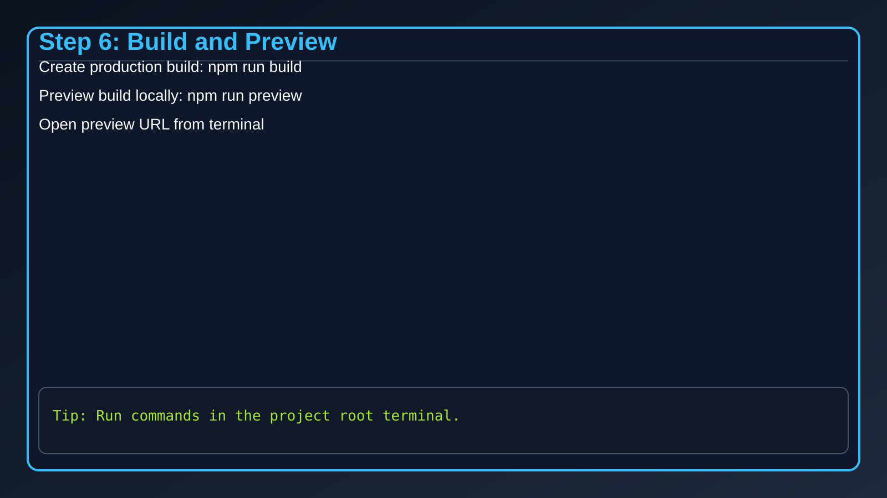

# User Manual - Running SaidPiece Project

This manual provides complete step-by-step instructions to run the project locally.

## Picture Index

1. 
2. 
3. 
4. 
5. 
6. 

## Step 1: Install Prerequisites

Install the following before running the project:

- Node.js 18 or higher (LTS recommended)
- npm (comes with Node.js)

Verify installation in terminal:

```powershell
node -v
npm -v
```

## Step 2: Open the Project Folder

Open terminal (PowerShell) and move to the project directory:

```powershell
cd "D:\My Files\Projects\saidpiece"
```

Confirm you are in the correct folder:

```powershell
Get-ChildItem
```

You should see files like `package.json`, `vite.config.js`, and `src`.

## Step 3: Install Dependencies

Install project dependencies once:

```powershell
npm install
```

Wait for installation to finish with no errors.

## Step 4: Configure Environment Variables

Create or update `.env` file in the root folder.

Required keys:

```env
VITE_SUPABASE_URL=your_supabase_project_url
VITE_SUPABASE_ANON_KEY=your_supabase_anon_key
```

Notes:

- Keep `.env` in the same level as `package.json`.
- Do not add quotes around values unless required.

## Step 5: Start the Development Server

Run:

```powershell
npm run dev
```

Vite will show a local URL, usually:

```text
http://localhost:5173
```

Open that URL in your browser.

## Step 6: Build and Preview Production Version

Create optimized production build:

```powershell
npm run build
```

Preview production build locally:

```powershell
npm run preview
```

Open the preview URL shown in terminal.

## Useful Commands

```powershell
npm run dev      # Development mode
npm run build    # Production build
npm run preview  # Preview built app
npm run lint     # Lint check
```

## Troubleshooting

1. `npm install` fails:
- Delete `node_modules` and `package-lock.json`, then run `npm install` again.

2. App does not start:
- Check Node version: `node -v`.
- Confirm `.env` keys are present and correct.

3. Port already in use:
- Stop other local servers on port `5173`, or run with different host/port options.

4. Blank page or Supabase errors:
- Verify `VITE_SUPABASE_URL` and `VITE_SUPABASE_ANON_KEY` are valid.

## Project Start Checklist

- Node.js installed
- In correct project folder
- Dependencies installed
- `.env` configured
- `npm run dev` running
- App opens in browser
