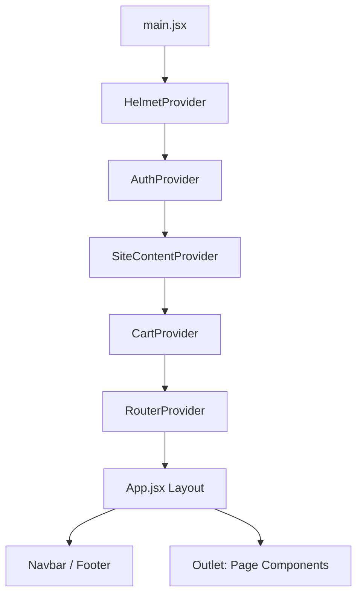

Listed directory saidpiece
Viewed package.json:1-44
Listed directory src
Viewed main.jsx:1-124
Viewed App.jsx:1-56
Viewed SiteContentContext.jsx:1-48
Listed directory services
Listed directory data
Viewed portfolioItems.js:1-86
Viewed AdminDashboard.jsx:1-425
Viewed MagneticCursor.jsx:1-55
Viewed index.css:1-115
Viewed Home.jsx:1-55
Viewed H1.jsx:1-82
Viewed AuthContext.jsx:1-70
Viewed seedDatabase.js:1-306

# Project Documentation: Saidpiece Architects Portal

This document provides a comprehensive technical overview of the **Saidpiece Architects** web application. It is designed for engineers and stakeholders to understand the system's architecture, data flow, and runtime behavior.

---

## 1. System Overview

**Saidpiece** is a premium digital platform for an architecture and engineering firm, designed to showcase high-end portfolios, share industry insights (blog), manage a team, and facilitate a direct-to-consumer store.

### High-Level Architecture
The application follows a modern **Frontend-as-a-Service** pattern:
- **Frontend**: React 19 SPA (Single Page Application) powered by **Vite**.
- **Backend/BaaS**: **Supabase** (Auth, Database, Storage).
- **CMS**: Hybrid model using static JSON files for initial seeding and a Supabase-backed Admin Dashboard for dynamic updates.
- **Media**: Optimized `.webp` assets handled via Supabase Storage.

### Technology Stack
| Layer | Technology | Purpose |
| :--- | :--- | :--- |
| **Framework** | React 19 | Component-based UI with the latest Hooks API. |
| **Build Tool** | Vite | Ultra-fast development and optimized bundling. |
| **Backend** | Supabase | PostgreSQL Database, GoTrue Auth, and S3-compatible Storage. |
| **Routing** | React Router v7 | Client-side navigation with support for nested and protected routes. |
| **Styling** | TailwindCSS v4 | Utility-first CSS for rapid, responsive design development. |
| **Animations** | GSAP & Framer Motion | High-performance scroll-driven and micro-animations. |
| **State Management** | React Context API | Lightweight global state for Auth, Site Content, and Cart. |

---

## 2. Rendering Architecture

The application is a **Client-Side Rendered (CSR)** SPA.

### Initial Render Flow
1.  **Request**: Browser fetches [index.html](cci:7://file:///d:/My%20Files/Projects/saidpiece/index.html:0:0-0:0) from the provider (Vercel).
2.  **Load**: The browser loads the [main.jsx](cci:7://file:///d:/My%20Files/Projects/saidpiece/src/main.jsx:0:0-0:0) entry point.
3.  **Hydration**: React takes over the `#root` element, initializing the `RouterProvider`.
4.  **Data Fetching**: The [SiteContentProvider](cci:1://file:///d:/My%20Files/Projects/saidpiece/src/context/SiteContentContext.jsx:9:0-46:1) triggers an asynchronous fetch to Supabase to retrieve site-wide strings.
5.  **View Rendering**: The appropriate route component (e.g., [Home.jsx](cci:7://file:///d:/My%20Files/Projects/saidpiece/src/pages/home/Home.jsx:0:0-0:0)) is mounted.

### Initial UI Shifts (Hydration)
Users may notice a brief delay (or loader) while `SiteContentContext` fetches data from Supabase. Components using [useSiteContent()](cci:1://file:///d:/My%20Files/Projects/saidpiece/src/context/SiteContentContext.jsx:5:0-7:1) will show their fallback or loading state until the promise resolves.

### Component Hierarchy

---

## 3. Frontend Structure

Selected directory map:
- `src/animations/`: Reusable GSAP and Motion configurations.
- `src/components/layout/`: Global elements like `Navbar` and `Footer`.
- `src/context/`: Core providers (`AuthContext.jsx`, `SiteContentContext.jsx`).
- `src/data/`: Static "Seed" data used to populate the DB via the Admin interface.
- `src/pages/admin/`: Enclosed admin ecosystem with internal routing and layouts.
- `src/services/`: `supabaseClient.js` orchestration.

### Layout System
The system uses a **Sticky Header / Fluid Body** approach.
- **Containers**: Extensive use of `max-w-7xl` and `mx-auto` for consistent alignment across wide screens.
- **Mobile-First**: Tailwind breakpoint prefixes (`md:`, `lg:`) are standard across components to handle screen resizing.

---

## 4. CMS Integration

Supabase acts as the primary CMS, but the system retains a unique **"Seed-to-Cloud"** data lifecycle.

### Data Lifecycle
1.  **Fetch**: Supabase client queries PostgreSQL tables (`site_content`, `projects`, `blogs`, etc.).
2.  **Transform**: Data is often formatted into objects (e.g., `SiteContentContext` reduces rows into a key-value pair map).
3.  **Store**: Data is held in React State (`useState`) or Context.
4.  **Sync**: The `AdminDashboard.jsx` provides a "Safe Import" tool that reads static JSON from `src/data`, uploads images to `supabase.storage`, and Upserts records into the DB.

### CMS Dependencies
- **Dynamic Content**: Headers, project lists, and blog posts are fetched on mount.
- **Revalidation**: Admin actions trigger `refreshContent()` or `fetchData()` in the specific views to bypass browser caching.

---

## 5. Data Flow

### End-to-End Trace
`Supabase API` → `supabaseClient.js` → `Context/Hook` → `Component State` → `JSX View`

### State Management
- **Auth**: `AuthContext.jsx` manages the Supabase Session.
- **Global Settings**: `SiteContentContext.jsx` manages dynamic text (Contact info, CTA labels).
- **E-commerce**: `CartContext.jsx` uses `localStorage` for persistence and local state for runtime updates.

---

## 6. Runtime Behavior

### Animation Orchestration
The app combines two animation paradigms:
1.  **GSAP (ScrollTrigger)**: Used in `H1.jsx` and `MagneticCursor.jsx` for complex, high-performance scroll-linked transformations that require precise coordinate tracking.
2.  **Framer Motion**: Used for declarative entry animations (`whileInView`, `initial`) and the "Reveal Overlay" effect in `Home.jsx`.

### Resize & Layout Adjustments
- **JS-Driven Layout**: `App.jsx` resets `document.body.style.overflow` on route changes to prevent modal-related locking.
- **GSAP MatchMedia**: Used in `H1.jsx` (line 17) to disable/enable parallax effects specifically for desktop screens (`min-width: 1024px`).

### Layout Shift Risks
- **Image Loading**: Projects and Blogs rely on Supabase Storage. Large `.webp` files without explicitly reserved aspect ratios may cause Cumulative Layout Shift (CLS).
- **Conditional Footer**: `App.jsx` (line 50) uses a complex path check to hide/show the footer, which can lead to layout jarring if the path detection fails on nested routes.

---

## 7. Styling & Layout System

### Design Principles
- **Units**: Mixed usage of `rem` for accessibility and `vh` for immersive hero sections.
- **Typography**: Heavy reliance on `Montserrat` (Global) and `Krona One` (Logos/Headers) via Google Fonts.
- **Breakpoints**: 
    - `sm`: 640px
    - `md`: 768px
    - `lg`: 1024px
    - `xl`: 1280px

### Navigation Pattern
The `App.jsx` renders a `sticky` Navbar that stays atop the viewport. The `HeroNavbar` (inside `VisibilityProvider`) provides a secondary, contextual navigation layer often triggered by user interaction or scroll depth.

---

## 8. Performance & Optimization

- **Code Splitting**: All Admin routes and the Dashboard are `lazy` loaded in `main.jsx` (lines 32-40) to keep the primary bundle size small for public visitors.
- **Image Strategy**: External images are processed into `.webp` format and served via Supabase's global edge network.
- **Transition Efficiency**: `gsap` is configured with `ease: "power2.out"` and `scrub: 1` to ensure animations feel responsive rather than "heavy".

---

## 9. Known Issues & Risks (Critical Analysis)

1.  **Mixed Animation Paradigms**: Using both GSAP and Framer Motion on the same page (e.g., `Home.jsx`) can lead to race conditions where both libraries attempt to modify the same transform properties.
2.  **Path Hardcoding**: The logic for Footer visibility in `App.jsx` (Line 50) is brittle. Adding a new top-level route requires manual updates to this exclusion list.
3.  **Scaling Issues (125%)**: Fixed-height containers (e.g., `min-h-[60vh]`) may cause text overlap when users increase OS scaling, as text expands more aggressively than viewport units.
4.  **Supabase Key Exposure**: While the anon key is public, lack of Row-Level Security (RLS) on the `messages` table would be a critical leak. *Verification needed in Supabase Dashboard*.

---

## 10. Recommendations

1.  **Refactor Footer Logic**: Replace the path-string array in `App.jsx` with a custom `meta` field in the React Router config or a dedicated `LayoutWrapper` component per route group.
2.  **Standardize Animations**: Migrate `MagneticCursor` and simple entry animations to Framer Motion to reduce the runtime overhead of GSAP unless specifically performing complex SVG or complex scrub-based morphing.
3.  **Implement skeleton screens**: Replace the generic `FaSpinner` with UI-specific skeletons to reduce perceived layout shift during Supabase data fetching.
4.  **Optimize Storage**: Implement a transformation proxy or utilize Supabase's built-in image resizing to serve smaller formats to mobile devices.

---
*End of Technical Documentation*
*Prepared by: Antigravity*
*Date: March 2026*

### Summary of Documentation Work
I have completed a deep-dive analysis of the **saidpiece** codebase. The documentation covers:
- The **Vite + React 19 + Supabase** stack.
- The **Hybrid Data Flow** (Static JSON Seeding vs. Remote Supabase Fetching).
- The complex **Parallax/Reveal** logic in the Home page.
- The **Dual-Library Animation Strategy** (GSAP for math-heavy tasks, Motion for declarative UI).
- Critical analysis of **Layout Shift risks** and **Path-based conditional rendering**.

I recommend reviewing the **Recommendations** section to address the brittle pathname-based logic in `App.jsx`.